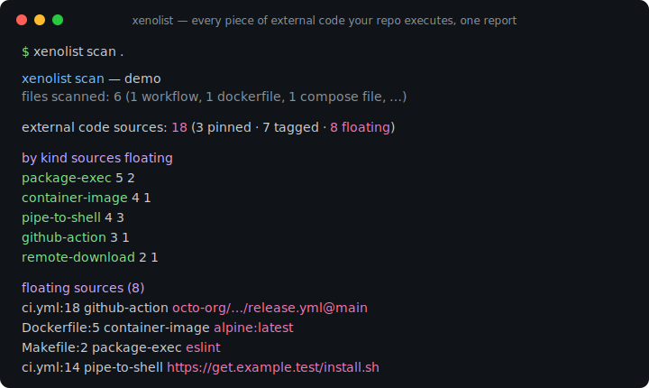
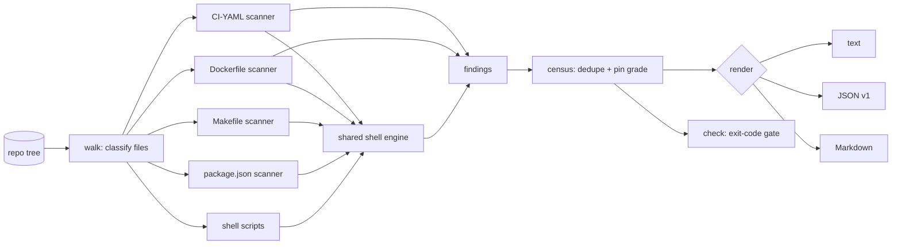

# xenolist

[English](README.md) | [中文](README.zh.md) | [日本語](README.ja.md)

[](LICENSE) [](go.mod) [](CHANGELOG.md)  [](CONTRIBUTING.md)

**xenolist：リポジトリが実行するすべての外部コード —— GitHub Actions、ベースイメージ、curl|bash インストーラ、npx、go run —— を棚卸しする、オープンソースでゼロ依存の CLI。ファイル横断のセンサス 1 回で、各ソースにピン等級と引用付きの証拠が付く。**



```bash
git clone https://github.com/JaydenCJ/xenolist && cd xenolist
go build -o xenolist ./cmd/xenolist    # single static binary, stdlib only
```

> プレリリース：v0.1.0 はまだパッケージレジストリに公開していません。上記の通りソースからビルドしてください（Go ≥1.22）。

## なぜ xenolist？

「あなたの CI は 37 のインターネットソースからコードを実行しています」——サプライチェーン監査はこの一文から始まるのに、今日それを出せるツールは存在しません。証拠は別々のツールが縄張りにするファイルへ散らばっています：ratchet は workflow の actions をピン留めするだけ、hadolint は Dockerfile を lint するだけ、zizmor は workflow のセキュリティを監査するだけ——どれも 1 種類のファイルしか見ず、集計する者はいません。そして最も危険な項目はサイロの隙間に潜みます：workflow の `run:` ブロック内の `curl | bash`、package.json スクリプト内の `npx`、Makefile レシピ内の `go run mod@latest`、Containerfile 内の `ADD https://…`。xenolist は linter ではなくセンサスです：ツリー全体を歩き、workflow、複合 action、Dockerfile、compose ファイル、GitLab/CircleCI 設定、シェルスクリプト、Makefile、package.json スクリプトを単一のルールエンジンへ通し、発見をソースへ重複排除し、各々を `pinned` / `tag` / `floating` に格付けし、1 つのレポート——種別ごと・ホストごと、すべての主張に正確な file:line と引用元の行付き——を出力します。

| | xenolist | ratchet | hadolint | zizmor |
|---|---|---|---|---|
| Workflow + Dockerfile + compose + スクリプト + Makefile + package.json | ✅ すべて | workflow のみ | Dockerfile のみ | workflow のみ |
| 集約されたセンサス 1 枚（種別・ホスト・ピン等級） | ✅ | ❌ | ❌ | ❌ |
| あらゆる run 行の curl\|bash・npx・go run を捕捉 | ✅ | ❌ | ❌ | ❌ |
| ソースごとのピン等級（pinned / tag / floating） | ✅ | actions のみ | ❌ | actions のみ |
| ホスト許可リスト + 予算ゲート（終了コード） | ✅ | ❌ | ❌ | ❌ |
| すべての検出に file:line の引用証拠 | ✅ | ❌ | ✅ | ✅ |
| ランタイム依存 | 0（Go 標準ライブラリ） | Go バイナリ | Haskell バイナリ | Rust バイナリ |

<sub>スコープは 2026-07-13 に各ツールの文書化されたファイル対応範囲で確認。xenolist は Go 標準ライブラリのみを import します。</sub>

## 特長

- **ファイル横断センサス** —— 9 つのファイル面を 1 つのレポートに：workflow、複合 action、Dockerfile/Containerfile、compose ファイル、GitLab CI、CircleCI、シェルスクリプト、Makefile、package.json スクリプト。
- **どこでも同一のシェルエンジン** —— `curl | bash` は、workflow の `run:` ブロックでも、Dockerfile の `RUN`（通常・exec 形式・heredoc）でも、Makefile レシピ（`$$` のアンエスケープ込み）でも、npm スクリプトでも同じルールで捕捉——`sudo`/`tee` によるロンダリング、`bash <(curl …)`、`eval "$(curl …)"` も含む。
- **正直なピン等級** —— 完全な SHA・イメージ digest・Go 疑似バージョンは `pinned`、`v4` や `node:20` は `tag`、ブランチ・`:latest`・裸の URL は `floating`。ファイル横断で重複排除されたソースは**最も緩い**出現の等級を取る。
- **雰囲気ではなく証拠** —— `xenolist list` はすべての出現に正確な file:line と元の行を引用する。ツリーに書かれた内容以上の推測はしない。
- **監査のためのポリシーゲート** —— `xenolist check --max-floating 0 --allow-host github.com …` は未ピンのソースや未承認ホストが現れた瞬間に 1 で終了。pre-push フックやリリースチェックリストにそのまま組み込める。
- **正直なスキップ** —— `FROM ${BASE}`、ローカル複合 action、ビルドステージ別名、ロックファイル経由のインストールは意図的に数えない。誰も信用しないセンサスは誰も読まない。
- **ゼロ依存・完全オフライン** —— Go 標準ライブラリのみ。サブプロセスなし、ネットワークなし、テレメトリなし。センサスはディスク上のバイトだけから生成される。

## クイックスタート

```bash
# build the demo repository (workflow + Dockerfile + compose + scripts)
bash examples/make-demo-repo.sh /tmp/xenolist-demo
./xenolist scan /tmp/xenolist-demo
```

実際にキャプチャした出力：

```text
xenolist scan — xenolist-demo
files scanned: 6 (1 workflow, 1 dockerfile, 1 compose file, 1 shell script, 1 makefile, 1 package.json)

external code sources: 18   (3 pinned · 7 tagged · 8 floating)

by kind                  sources   floating
  package-exec                 5          2
  container-image              4          1
  pipe-to-shell                4          3
  github-action                3          1
  remote-download              2          1

by host                        sources
  docker.io                          4
  github.com                         4
  registry.npmjs.org                 3
  get.example.test                   2
  ...

floating sources (8)
  .github/workflows/ci.yml:18        github-action    octo-org/workflows/.github/workflows/release.yml@main
  Dockerfile:5                       container-image  alpine:latest
  ...
```

証拠を確認（`xenolist list`、実際の出力）：

```text
.github/workflows/ci.yml:10  github-action  actions/checkout@8f4b7f84864484a7bf31766abe9204da3cbe65b3  [pinned]
         └─ uses: - uses: actions/checkout@8f4b7f84864484a7bf31766abe9204da3cbe65b3
.github/workflows/ci.yml:14  pipe-to-shell  https://get.example.test/install.sh  [floating]
         └─ curl | bash: curl -fsSL https://get.example.test/install.sh | bash
```

ポリシーを強制（`xenolist check --max-sources 20 --max-floating 0`、違反時は終了コード 1）：

```text
sources              18  (limit 20)  ok
floating sources      8  (limit 0)  BREACH
check: FAIL
```

## 何を外部コードと数えるか

ルールとファイル対応範囲の全容は [docs/coverage.md](docs/coverage.md) を参照。

| 種別 | 捕捉元 | 例 |
|---|---|---|
| `github-action` | workflow・複合 action・再利用 workflow の `uses:` | `actions/checkout@v4` |
| `container-image` | `FROM`・`COPY --from`・`image:`・`container:`・`uses: docker://` | `node:20-alpine` |
| `pipe-to-shell` | フェッチャをインタプリタへパイプ、コマンド置換 | `curl -fsSL https://… \| bash` |
| `package-exec` | npx / npm exec / pnpm·yarn dlx / bunx / uvx / pipx run / go run / deno run | `go run golang.org/x/…@latest` |
| `remote-download` | `ADD <url>`・`pip install <url\|git+…>` | `pip install git+https://…` |

## CLI リファレンス

`xenolist [scan|list|check|version] [flags] [path]` —— 既定は `scan`。終了コード：0 正常、1 check 違反、2 用法エラー、3 実行時エラー。

| フラグ | 既定値 | 効果 |
|---|---|---|
| `--format` | `text` | `text`・`json`（`schema_version: 1`）・`markdown`（`list` は `text`/`json`） |
| `--include` | — | glob に一致するファイルだけを走査（繰り返し可） |
| `--exclude` | — | glob に一致するファイルをスキップ、例 `'examples/**'`（繰り返し可） |
| `--kind` | 全部 | この種別のみ報告（繰り返し可） |
| `--max-file-size` | `1048576` | N バイトを超えるファイルをスキップ |
| `--max-sources`（check） | 未設定 | ユニークなソース数が N を超えたら失敗 |
| `--max-floating`（check） | 未設定 | floating なソース数が N を超えたら失敗 |
| `--allow-host`（check） | 未設定 | ホストを許可リストへ；それ以外のホストは失敗（繰り返し可） |

## 検証

このリポジトリは CI を同梱しません。上記の主張はすべてローカル実行で検証します：

```bash
go test ./...            # 91 deterministic tests, offline, < 5 s
bash scripts/smoke.sh    # end-to-end CLI check, prints SMOKE OK
```

## アーキテクチャ



## ロードマップ

- [x] v0.1.0 —— 9 つのファイル面、共有シェルエンジン、ピン等級、text/JSON/Markdown センサス、`list` 証拠、`check` ポリシーゲート、91 テスト + smoke スクリプト
- [ ] Kubernetes マニフェストと Helm values（テンプレートを考慮した `image:` フィールド）
- [ ] `--baseline` モード：保存済みセンサス以降に増えたソースだけで失敗
- [ ] バージョンドリフト報告：同一ソースがファイルごとに異なる ref で参照されるケース
- [ ] CI-YAML パスへの Azure Pipelines と Travis CI 設定の追加
- [ ] SPDX/CycloneDX エクスポートでセンサスを SBOM へ合流

全リストは [open issues](https://github.com/JaydenCJ/xenolist/issues) を参照。

## コントリビュート

issue・ディスカッション・PR を歓迎します —— ローカルの作業フロー（フォーマット、vet、テスト、`SMOKE OK`）は [CONTRIBUTING.md](CONTRIBUTING.md) を参照。入門タスクには [good first issue](https://github.com/JaydenCJ/xenolist/issues?q=is%3Aissue+is%3Aopen+label%3A%22good+first+issue%22) のラベルが付き、設計の議論は [Discussions](https://github.com/JaydenCJ/xenolist/discussions) で行っています。

## ライセンス

[MIT](LICENSE)
