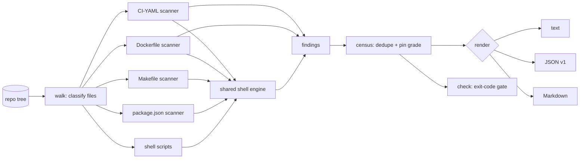

# xenolist

[English](README.md) | [中文](README.zh.md) | [日本語](README.ja.md)

[](LICENSE) [](go.mod) [](CHANGELOG.md)  [](CONTRIBUTING.md)

**xenolist：an open-source, zero-dependency CLI that inventories every piece of external code your repository executes — GitHub Actions, base images, curl|bash installers, npx, go run — one cross-file census, with a pin grade and quoted evidence for every source.**


```bash
git clone https://github.com/JaydenCJ/xenolist && cd xenolist
go build -o xenolist ./cmd/xenolist    # single static binary, stdlib only
```

> Pre-release: v0.1.0 is not tagged on a package registry yet; build from source as above (any Go ≥1.22).

## Why xenolist?

"Your CI executes code from 37 internet sources" is the sentence every supply-chain audit starts with — and no tool today can produce it. The evidence is scattered across files that different tools own separately: ratchet pins the actions in your workflows, hadolint lints your Dockerfiles, zizmor audits workflow security — each sees one file type and none aggregates. Meanwhile the riskiest entries hide between the silos: the `curl | bash` inside a workflow `run:` block, the `npx` in a package.json script, the `go run mod@latest` in a Makefile recipe, the `ADD https://…` in a Containerfile. xenolist is the census, not another linter: it walks the whole tree, routes workflows, composite actions, Dockerfiles, compose files, GitLab/CircleCI configs, shell scripts, Makefiles, and package.json scripts through one shared rule engine, deduplicates what it finds into sources, grades each one `pinned` / `tag` / `floating`, and prints a single report — by kind, by host, with the exact file:line and quoted source line for every claim.

| | xenolist | ratchet | hadolint | zizmor |
|---|---|---|---|---|
| Workflows + Dockerfiles + compose + scripts + Makefiles + package.json | ✅ all | workflows only | Dockerfiles only | workflows only |
| One aggregated census (by kind, by host, by pin) | ✅ | ❌ | ❌ | ❌ |
| Catches curl\|bash, npx, go run inside any run line | ✅ | ❌ | ❌ | ❌ |
| Pin grading (pinned / tag / floating) per source | ✅ | actions only | ❌ | actions only |
| Host allowlist + budget gate with exit codes | ✅ | ❌ | ❌ | ❌ |
| Quoted file:line evidence for every finding | ✅ | ❌ | ✅ | ✅ |
| Runtime dependencies | 0 (Go stdlib) | Go binary | Haskell binary | Rust binary |

<sub>Scope checked 2026-07-13 against each tool's documented file coverage; xenolist imports the Go standard library only.</sub>

## Features

- **Cross-file census** — nine file surfaces, one report: workflows, composite actions, Dockerfiles/Containerfiles, compose files, GitLab CI, CircleCI, shell scripts, Makefiles, package.json scripts.
- **One shell engine everywhere** — `curl | bash` is caught by the same rule in a workflow `run:` block, a Dockerfile `RUN` (plain, exec-form, or heredoc), a Makefile recipe (with `$$` unescaping), or an npm script — including `sudo`/`tee` laundering, `bash <(curl …)`, and `eval "$(curl …)"`.
- **Pin grades, honestly** — full SHAs, image digests, and Go pseudo-versions are `pinned`; `v4` and `node:20` are `tag`; branches, `:latest`, and bare URLs are `floating`. A source deduplicated across files takes its **loosest** occurrence.
- **Evidence, not vibes** — `xenolist list` quotes the exact file:line and source line for every occurrence; nothing is inferred beyond what is written in the tree.
- **Policy gate for audits** — `xenolist check --max-floating 0 --allow-host github.com …` exits 1 the moment an unpinned source or an unapproved host appears, ready for pre-push hooks and release checklists.
- **Honest skips** — `FROM ${BASE}`, local composite actions, build-stage aliases, and lockfile-managed installs are deliberately not counted; a census nobody trusts is a census nobody reads.
- **Zero dependencies, fully offline** — Go standard library only, no subprocesses, no network, no telemetry; the census is produced entirely from bytes on disk.

## Quickstart

```bash
# build the demo repository (workflow + Dockerfile + compose + scripts)
bash examples/make-demo-repo.sh /tmp/xenolist-demo
./xenolist scan /tmp/xenolist-demo
```

Real captured output:

```text
xenolist scan — xenolist-demo
files scanned: 6 (1 workflow, 1 dockerfile, 1 compose file, 1 shell script, 1 makefile, 1 package.json)

external code sources: 18   (3 pinned · 7 tagged · 8 floating)

by kind                  sources   floating
  package-exec                 5          2
  container-image              4          1
  pipe-to-shell                4          3
  github-action                3          1
  remote-download              2          1

by host                        sources
  docker.io                          4
  github.com                         4
  registry.npmjs.org                 3
  get.example.test                   2
  ...

floating sources (8)
  .github/workflows/ci.yml:18        github-action    octo-org/workflows/.github/workflows/release.yml@main
  Dockerfile:5                       container-image  alpine:latest
  ...
```

Ask for the evidence (`xenolist list`, real output):

```text
.github/workflows/ci.yml:10  github-action  actions/checkout@8f4b7f84864484a7bf31766abe9204da3cbe65b3  [pinned]
         └─ uses: - uses: actions/checkout@8f4b7f84864484a7bf31766abe9204da3cbe65b3
.github/workflows/ci.yml:14  pipe-to-shell  https://get.example.test/install.sh  [floating]
         └─ curl | bash: curl -fsSL https://get.example.test/install.sh | bash
```

Enforce a policy (`xenolist check --max-sources 20 --max-floating 0`, exit code 1 on breach):

```text
sources              18  (limit 20)  ok
floating sources      8  (limit 0)  BREACH
check: FAIL
```

## What counts as external code

Full rules and file coverage in [docs/coverage.md](docs/coverage.md).

| Kind | Caught from | Example |
|---|---|---|
| `github-action` | `uses:` in workflows, composite actions, reusable workflows | `actions/checkout@v4` |
| `container-image` | `FROM`, `COPY --from`, `image:`, `container:`, `uses: docker://` | `node:20-alpine` |
| `pipe-to-shell` | fetcher piped into an interpreter, substitutions | `curl -fsSL https://… \| bash` |
| `package-exec` | npx / npm exec / pnpm·yarn dlx / bunx / uvx / pipx run / go run / deno run | `go run golang.org/x/…@latest` |
| `remote-download` | `ADD <url>`, `pip install <url\|git+…>` | `pip install git+https://…` |

## CLI reference

`xenolist [scan|list|check|version] [flags] [path]` — `scan` is the default. Exit codes: 0 ok, 1 check breach, 2 usage error, 3 runtime error.

| Flag | Default | Effect |
|---|---|---|
| `--format` | `text` | `text`, `json` (`schema_version: 1`), or `markdown` (`list`: `text`/`json`) |
| `--include` | — | only scan files matching a glob (repeatable) |
| `--exclude` | — | skip files matching a glob, e.g. `'examples/**'` (repeatable) |
| `--kind` | all | only report this kind (repeatable) |
| `--max-file-size` | `1048576` | skip files larger than N bytes |
| `--max-sources` (check) | unset | fail when unique sources exceed N |
| `--max-floating` (check) | unset | fail when floating sources exceed N |
| `--allow-host` (check) | unset | allowlist a host; any other host fails (repeatable) |

## Verification

This repository ships no CI; every claim above is verified by local runs:

```bash
go test ./...            # 91 deterministic tests, offline, < 5 s
bash scripts/smoke.sh    # end-to-end CLI check, prints SMOKE OK
```

## Architecture



## Roadmap

- [x] v0.1.0 — nine file surfaces, shared shell engine, pin grading, text/JSON/Markdown census, `list` evidence, `check` policy gate, 91 tests + smoke script
- [ ] Kubernetes manifests and Helm values (`image:` fields with template awareness)
- [ ] `--baseline` mode: fail only on sources added since a saved census
- [ ] Version-drift report: same source referenced at different refs across files
- [ ] Azure Pipelines and Travis CI configs in the CI-YAML pass
- [ ] SPDX/CycloneDX export so the census can join an SBOM

See the [open issues](https://github.com/JaydenCJ/xenolist/issues) for the full list.

## Contributing

Issues, discussions and pull requests are welcome — see [CONTRIBUTING.md](CONTRIBUTING.md) for the local workflow (format, vet, tests, `SMOKE OK`). Good entry points are labelled [good first issue](https://github.com/JaydenCJ/xenolist/issues?q=is%3Aissue+is%3Aopen+label%3A%22good+first+issue%22), and design questions live in [Discussions](https://github.com/JaydenCJ/xenolist/discussions).

## License

[MIT](LICENSE)
