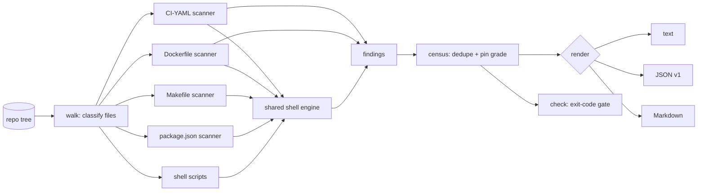

# xenolist

[English](README.md) | [中文](README.zh.md) | [日本語](README.ja.md)

[](LICENSE) [](go.mod) [](CHANGELOG.md)  [](CONTRIBUTING.md)

**xenolist：开源、零依赖的 CLI，清点仓库执行的每一份外部代码 —— GitHub Actions、基础镜像、curl|bash 安装脚本、npx、go run —— 一次跨文件普查，每个来源都带固定等级与引用证据。**


```bash
git clone https://github.com/JaydenCJ/xenolist && cd xenolist
go build -o xenolist ./cmd/xenolist    # single static binary, stdlib only
```

> 预发布：v0.1.0 尚未发布到任何包注册表；请按上述方式从源码构建（任意 Go ≥1.22）。

## 为什么选 xenolist？

“你的 CI 会执行来自 37 个互联网来源的代码”——每一次供应链审计都从这句话开始，而今天没有任何工具能把它说出来。证据散落在被不同工具各自认领的文件里：ratchet 只固定 workflow 里的 actions，hadolint 只 lint Dockerfile，zizmor 只审计 workflow 安全——每个工具只看一种文件，没有谁做聚合。而最危险的条目恰恰藏在孤岛之间：workflow `run:` 块里的 `curl | bash`、package.json 脚本里的 `npx`、Makefile 配方里的 `go run mod@latest`、Containerfile 里的 `ADD https://…`。xenolist 是普查，不是又一个 linter：它遍历整棵树，把 workflow、复合 action、Dockerfile、compose 文件、GitLab/CircleCI 配置、shell 脚本、Makefile、package.json 脚本全部送进同一套规则引擎，把发现去重成来源，逐一评为 `pinned` / `tag` / `floating`，最后输出一份报告——按类别、按主机，每条结论都附带准确的 file:line 与引用的源码行。

| | xenolist | ratchet | hadolint | zizmor |
|---|---|---|---|---|
| Workflow + Dockerfile + compose + 脚本 + Makefile + package.json | ✅ 全部 | 仅 workflow | 仅 Dockerfile | 仅 workflow |
| 一份聚合普查（按类别、主机、固定等级） | ✅ | ❌ | ❌ | ❌ |
| 捕获任意 run 行里的 curl\|bash、npx、go run | ✅ | ❌ | ❌ | ❌ |
| 每个来源的固定等级（pinned / tag / floating） | ✅ | 仅 actions | ❌ | 仅 actions |
| 主机白名单 + 预算门禁（退出码） | ✅ | ❌ | ❌ | ❌ |
| 每条发现都引用 file:line 证据 | ✅ | ❌ | ✅ | ✅ |
| 运行时依赖 | 0（Go 标准库） | Go 二进制 | Haskell 二进制 | Rust 二进制 |

<sub>范围核对于 2026-07-13，依据各工具文档声明的文件覆盖面；xenolist 仅导入 Go 标准库。</sub>

## 特性

- **跨文件普查** —— 九种文件表面，一份报告：workflow、复合 action、Dockerfile/Containerfile、compose 文件、GitLab CI、CircleCI、shell 脚本、Makefile、package.json 脚本。
- **同一套 shell 引擎覆盖全部** —— 无论 `curl | bash` 藏在 workflow `run:` 块、Dockerfile `RUN`（普通、exec 形式或 heredoc）、Makefile 配方（含 `$$` 反转义）还是 npm 脚本里，都由同一条规则捕获——包括 `sudo`/`tee` 洗白、`bash <(curl …)`、`eval "$(curl …)"`。
- **诚实的固定等级** —— 完整 SHA、镜像 digest、Go 伪版本判为 `pinned`；`v4` 与 `node:20` 判为 `tag`；分支、`:latest` 与裸 URL 判为 `floating`。跨文件去重后的来源取其**最松**的一次出现。
- **证据而非感觉** —— `xenolist list` 为每次出现引用准确的 file:line 与源码行；除了树里写着的内容，不做任何推断。
- **面向审计的门禁** —— `xenolist check --max-floating 0 --allow-host github.com …` 在出现未固定来源或未批准主机的那一刻退出 1，可直接接入 pre-push 钩子与发布清单。
- **诚实地跳过** —— `FROM ${BASE}`、本地复合 action、构建阶段别名、走锁文件的安装被刻意不计入；没人信任的普查就没人会读。
- **零依赖、完全离线** —— 仅 Go 标准库，无子进程，无网络，无遥测；普查完全由磁盘上的字节产出。

## 快速开始

```bash
# build the demo repository (workflow + Dockerfile + compose + scripts)
bash examples/make-demo-repo.sh /tmp/xenolist-demo
./xenolist scan /tmp/xenolist-demo
```

真实捕获的输出：

```text
xenolist scan — xenolist-demo
files scanned: 6 (1 workflow, 1 dockerfile, 1 compose file, 1 shell script, 1 makefile, 1 package.json)

external code sources: 18   (3 pinned · 7 tagged · 8 floating)

by kind                  sources   floating
  package-exec                 5          2
  container-image              4          1
  pipe-to-shell                4          3
  github-action                3          1
  remote-download              2          1

by host                        sources
  docker.io                          4
  github.com                         4
  registry.npmjs.org                 3
  get.example.test                   2
  ...

floating sources (8)
  .github/workflows/ci.yml:18        github-action    octo-org/workflows/.github/workflows/release.yml@main
  Dockerfile:5                       container-image  alpine:latest
  ...
```

查看证据（`xenolist list`，真实输出）：

```text
.github/workflows/ci.yml:10  github-action  actions/checkout@8f4b7f84864484a7bf31766abe9204da3cbe65b3  [pinned]
         └─ uses: - uses: actions/checkout@8f4b7f84864484a7bf31766abe9204da3cbe65b3
.github/workflows/ci.yml:14  pipe-to-shell  https://get.example.test/install.sh  [floating]
         └─ curl | bash: curl -fsSL https://get.example.test/install.sh | bash
```

执行策略（`xenolist check --max-sources 20 --max-floating 0`，违规时退出码 1）：

```text
sources              18  (limit 20)  ok
floating sources      8  (limit 0)  BREACH
check: FAIL
```

## 什么算外部代码

完整规则与文件覆盖面见 [docs/coverage.md](docs/coverage.md)。

| 类别 | 捕获自 | 示例 |
|---|---|---|
| `github-action` | workflow、复合 action、可复用 workflow 中的 `uses:` | `actions/checkout@v4` |
| `container-image` | `FROM`、`COPY --from`、`image:`、`container:`、`uses: docker://` | `node:20-alpine` |
| `pipe-to-shell` | 抓取器管道接入解释器、命令替换 | `curl -fsSL https://… \| bash` |
| `package-exec` | npx / npm exec / pnpm·yarn dlx / bunx / uvx / pipx run / go run / deno run | `go run golang.org/x/…@latest` |
| `remote-download` | `ADD <url>`、`pip install <url\|git+…>` | `pip install git+https://…` |

## CLI 参考

`xenolist [scan|list|check|version] [flags] [path]` —— 默认子命令是 `scan`。退出码：0 正常，1 check 违规，2 用法错误，3 运行时错误。

| 参数 | 默认值 | 作用 |
|---|---|---|
| `--format` | `text` | `text`、`json`（`schema_version: 1`）或 `markdown`（`list`：`text`/`json`） |
| `--include` | — | 只扫描匹配 glob 的文件（可重复） |
| `--exclude` | — | 跳过匹配 glob 的文件，如 `'examples/**'`（可重复） |
| `--kind` | 全部 | 只报告该类别（可重复） |
| `--max-file-size` | `1048576` | 跳过大于 N 字节的文件 |
| `--max-sources`（check） | 未设置 | 唯一来源数超过 N 即失败 |
| `--max-floating`（check） | 未设置 | 浮动来源数超过 N 即失败 |
| `--allow-host`（check） | 未设置 | 加入主机白名单；其它主机即失败（可重复） |

## 验证

本仓库不携带 CI；上述每一条主张都由本地运行验证：

```bash
go test ./...            # 91 deterministic tests, offline, < 5 s
bash scripts/smoke.sh    # end-to-end CLI check, prints SMOKE OK
```

## 架构



## 路线图

- [x] v0.1.0 —— 九种文件表面、共享 shell 引擎、固定等级、text/JSON/Markdown 普查、`list` 证据、`check` 策略门禁、91 个测试 + smoke 脚本
- [ ] Kubernetes 清单与 Helm values（`image:` 字段，含模板感知）
- [ ] `--baseline` 模式：只在相对已存普查新增来源时失败
- [ ] 版本漂移报告：同一来源在不同文件里引用不同 ref
- [ ] CI-YAML 流程接入 Azure Pipelines 与 Travis CI 配置
- [ ] SPDX/CycloneDX 导出，让普查汇入 SBOM

完整列表见 [open issues](https://github.com/JaydenCJ/xenolist/issues)。

## 贡献

欢迎 issue、讨论与 PR —— 本地工作流（格式化、vet、测试、`SMOKE OK`）见 [CONTRIBUTING.md](CONTRIBUTING.md)。入门任务标注为 [good first issue](https://github.com/JaydenCJ/xenolist/issues?q=is%3Aissue+is%3Aopen+label%3A%22good+first+issue%22)，设计问题请到 [Discussions](https://github.com/JaydenCJ/xenolist/discussions)。

## 许可证

[MIT](LICENSE)
